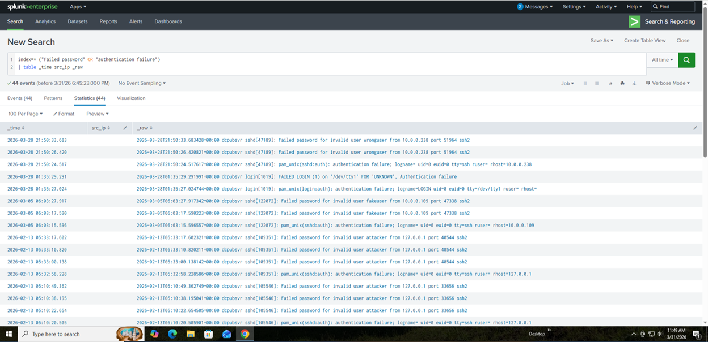
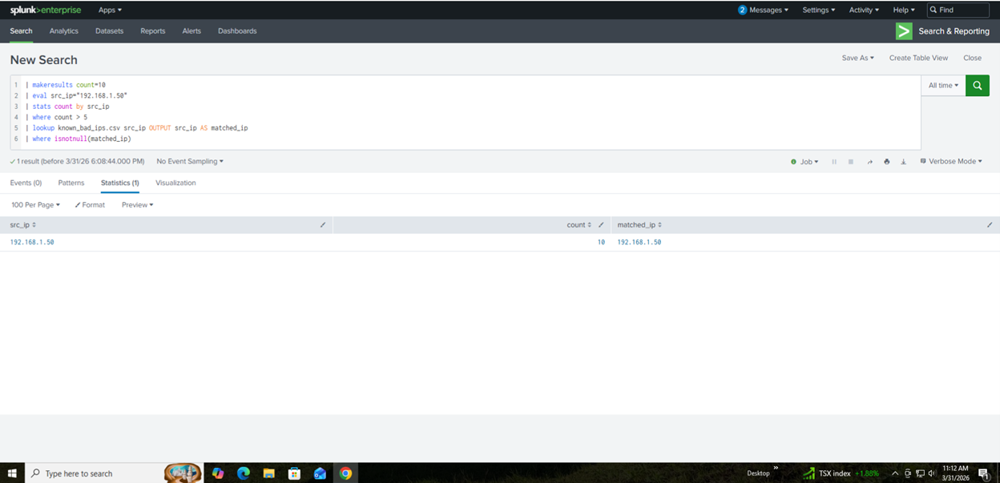

# SOC Detection Engineering Project — SSH Brute Force with Threat Intelligence Correlation

---

## Detection Output

### Raw Brute Force Logs


### Detection with Threat Intelligence Correlation


## 1. Project Overview

This project demonstrates the design and validation of a Security Operations Center (SOC) detection use case in Splunk. The detection identifies SSH brute force activity and correlates it with a custom threat intelligence dataset.

The implementation focuses on detection engineering principles, including event aggregation, threshold-based detection, and enrichment using lookup tables.

---

## 2. Objectives

* Detect repeated failed authentication attempts indicative of brute force attacks
* Correlate detected activity with known malicious IP addresses
* Simulate attack data to validate detection logic
* Document investigation and response workflow
* Build a structured, reproducible SOC use case

---

## 3. Architecture

### Components

* Splunk Enterprise (Ubuntu Server VM) — SIEM platform
* Windows VM — Log source and data forwarder
* Splunk Universal Forwarder — Log ingestion
* Custom Lookup Table — Threat intelligence simulation

### Data Flow

1. Logs are generated on the Windows system
2. Universal Forwarder sends logs to Splunk Enterprise
3. Splunk indexes and processes the data
4. Detection logic aggregates and filters events
5. Lookup table enriches events with threat intelligence

---

## 4. Data Sources

* Authentication logs (failed login attempts)
* Simulated event data using Splunk SPL
* Threat intelligence lookup (known_bad_ips.csv)

---

## 5. Detection Strategy

### Detection Logic

The detection identifies IP addresses generating multiple failed authentication attempts and correlates them with known malicious IPs.

```spl
index=* ("Failed password" OR "authentication failure")
| stats count by src_ip
| where count > 5
| lookup known_bad_ips.csv src_ip OUTPUT src_ip AS matched_ip
| where isnotnull(matched_ip)
```

### Key Concepts

* Threshold-based detection (count > 5)
* Event aggregation using stats
* Threat intelligence enrichment using lookup
* Noise reduction by filtering only matched IPs

---

## 6. Simulation and Validation

To validate the detection logic, simulated brute force activity was generated.

```spl
| makeresults count=10
| eval src_ip="192.168.1.50"
| stats count by src_ip
| where count > 5
| lookup known_bad_ips.csv src_ip OUTPUT src_ip AS matched_ip
| where isnotnull(matched_ip)
```

### Validation Outcome

* Source IP: 192.168.1.50
* Failed Attempts: 10
* Threat Intelligence Match: Confirmed

The detection successfully identified and correlated malicious activity.

---

## 7. Investigation Workflow

Upon detection, the following investigation steps are performed:

1. Validate detection accuracy and threshold
2. Analyze failed authentication logs
3. Identify targeted accounts and systems
4. Check for successful login attempts
5. Correlate with additional activity from the same IP
6. Verify IP reputation using threat intelligence sources

---

## 8 False Positive Mitigation

Exclude known administrative IP addresses (internal networks)
Tune threshold based on baseline authentication behavior
Filter service accounts generating expected login failures
Correlate only with threat intelligence to reduce noise
Monitor for repeated patterns rather than single events

---

## 9. Response Actions

* Block malicious IP at network level
* Disable or secure targeted accounts
* Enforce stronger authentication controls
* Monitor for repeated or distributed attempts
* Escalate if compromise indicators are present

---

## 10. Project Structure

```
case_studies/
playbooks/
lookups/
queries/
screenshots/
```

---

## 11. Key Skills Demonstrated

* SPL query development
* Detection engineering
* Threat intelligence integration
* Log analysis and correlation
* SOC investigation methodology
* Security use case validation

---

## 12. Assumptions and Limitations

* Detection is based on simulated and limited log data
* Threshold values may vary in production environments
* Lookup table represents a simplified threat intelligence source
* Index and field names may differ across environments

---

## 13. Future Improvements

* Integrate real authentication logs from Linux systems
* Add geo-location enrichment
* Implement risk-based scoring
* Tune detection thresholds using baseline analysis
* Automate alerting and response workflows

---

## 14. Conclusion

This project demonstrates a complete SOC detection workflow, from data ingestion and detection logic to validation and response. It highlights the practical application of detection engineering techniques using Splunk and provides a reproducible framework for identifying brute force attacks enriched with threat intelligence.

---

## 15. Evidence

Refer to the screenshots directory for detection results and validation output.
